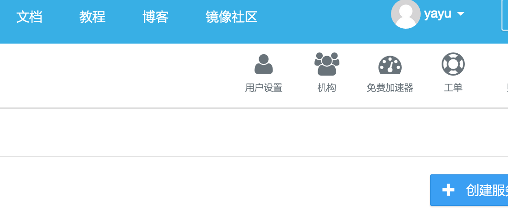
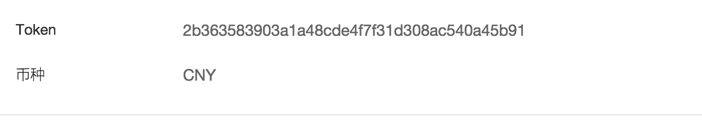

## Alauda REST API

您需要使用您的 `Alauda API Token`来发起 API请求。
请到[alauda.cn](alauda.cn)页面登陆到您的账户，查看您的`Token`:

`Alauda REST API`的地址为:

`https://api.alauda.cn/`

发起的API请求需要在头部加入下列认证信息:

`Authorization:Token your-token`

