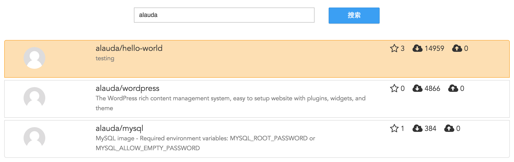
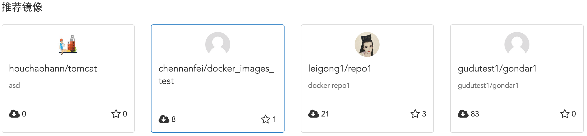
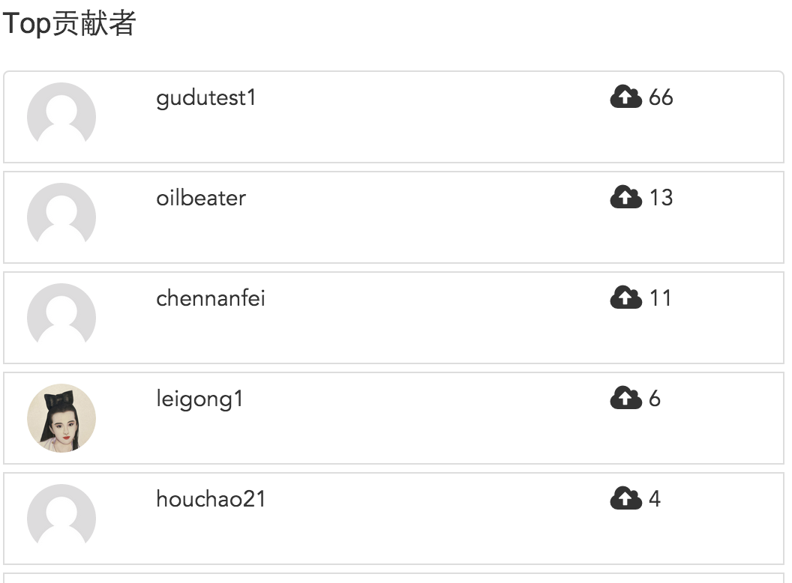
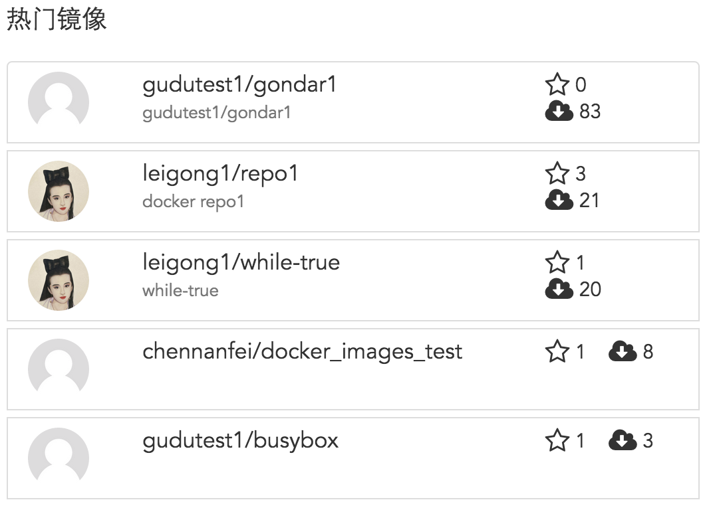
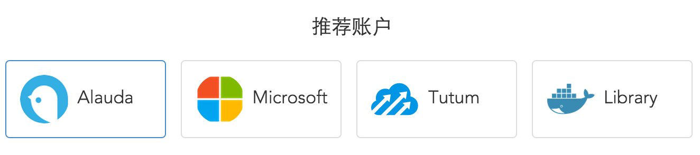

# 浏览镜像
Alauda镜像仓库源为您提供了浏览其他用户的所有公有的镜像仓库，并且提供了检索浏览的功能。可以通过在输入框输入镜像或命名空间的关键字来检索您需要的镜像仓库。

在页面的上方会显示出我们为您推荐的一些镜像。

同时在页面的左侧，显示出在Alauda镜像仓库源中上传镜像最多的前十名用户，在右侧显示出该用户上传的镜像总数。

页面右侧显示一些热门的镜像仓库，通过镜像仓库的下载次数列出前六名，右侧显示为收藏数，镜像下载次数和上传次数。

在页面最下方我们会为您推荐四个账户，点击这些账户可以查看这些账户的镜像仓库并进行创建服务：

