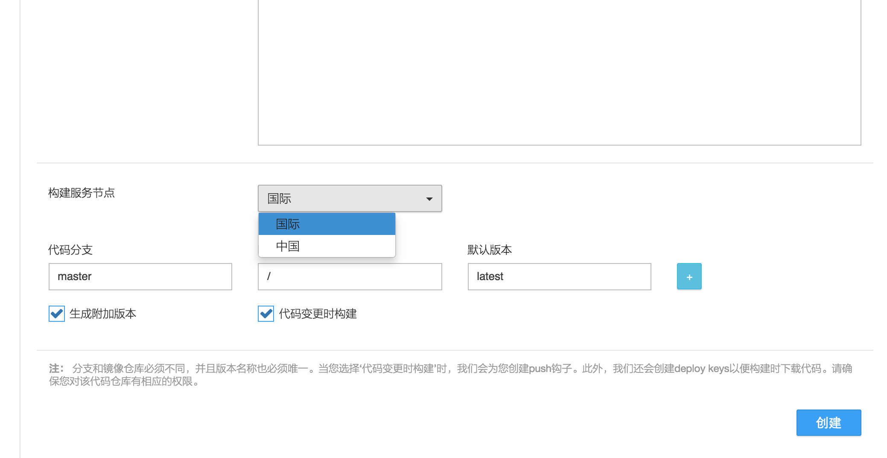

# 如何选择镜像构建服务节点

目前灵雀云为用户构建镜像提供两个服务节点，国内节点和国际节点。正确选择服务节点可以大大提高镜像构建速度。

由于网络因素，从国内访问国外的有些资源时，会出现访问不到的情况。同样，在构建镜像时，如果镜像所依赖的软件包无法在国内访问，在国内节点上构建往往会失败。用国际节点进行构建，就不会有这样的问题，镜像构建的速度和成功率都会高很多，但由于Alauda.cn镜像仓库源（registry）部署在国内，在构建完成后将镜像推送到Alauda.cn registry速度会比较慢。此外，国内节点使用了缓存机制，会省去构建的一些步骤，从而提高构建速度。

鉴于此，我们推荐的方案是：如果您已知镜像所依赖的软件包均来自国内，您可以选用国内服务节点，这样镜像构建和推送会很快完成。如果镜像确实有依赖国外资源，您基本上需要选择国际节点进行构建。您也可以考虑把应用所依赖的软件包构建成一个基础镜像，这次构建可在国际节点进行。然后以这个镜像为基础，在国内节点构建您的应用的镜像。这样，即提高了构建的成功率，又节省了远程推送很大镜像的时间。

您在创建镜像构建仓库或之后修改构建配置时，均可指定镜像构建所使用的服务节点，如下图：

