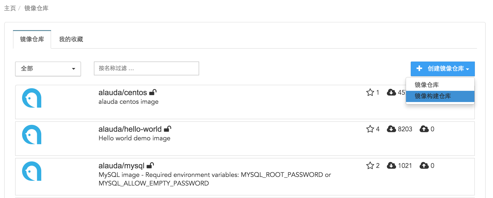
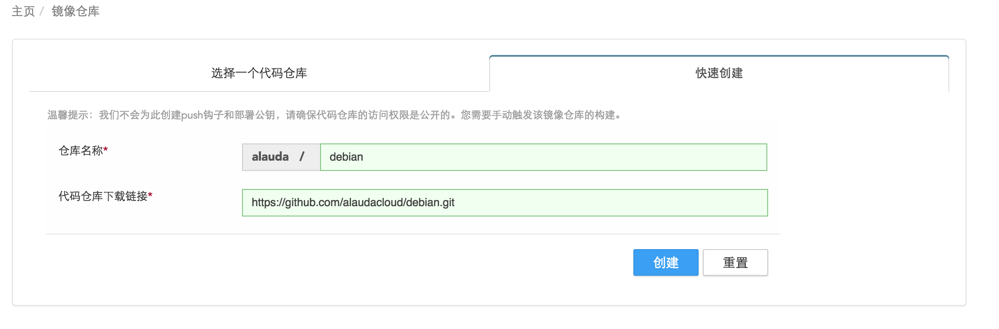
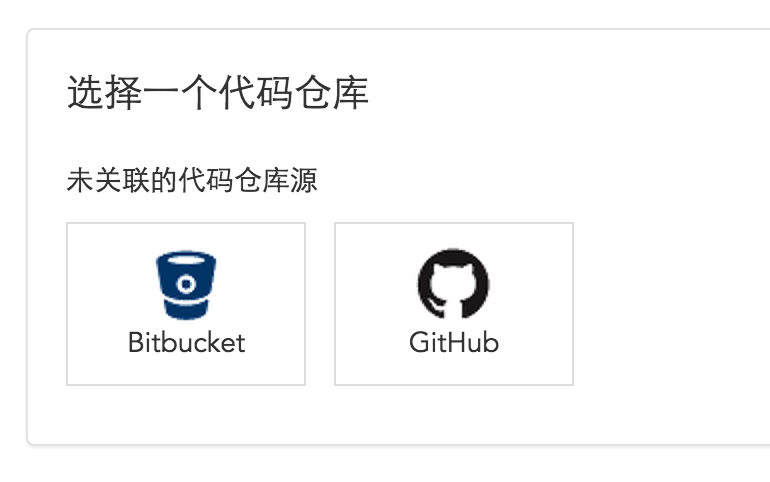
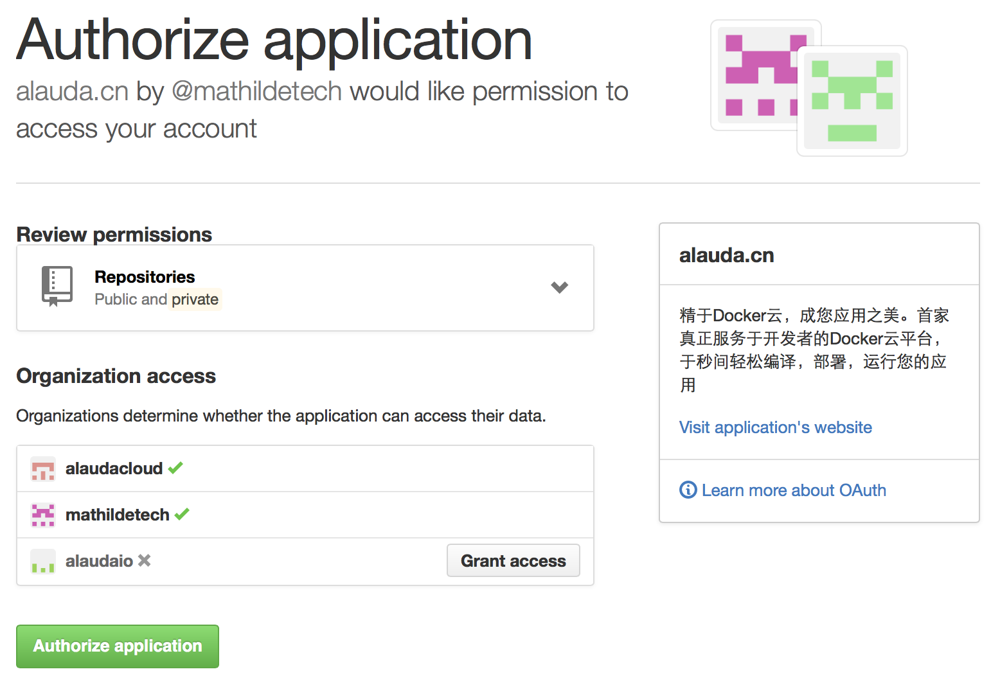
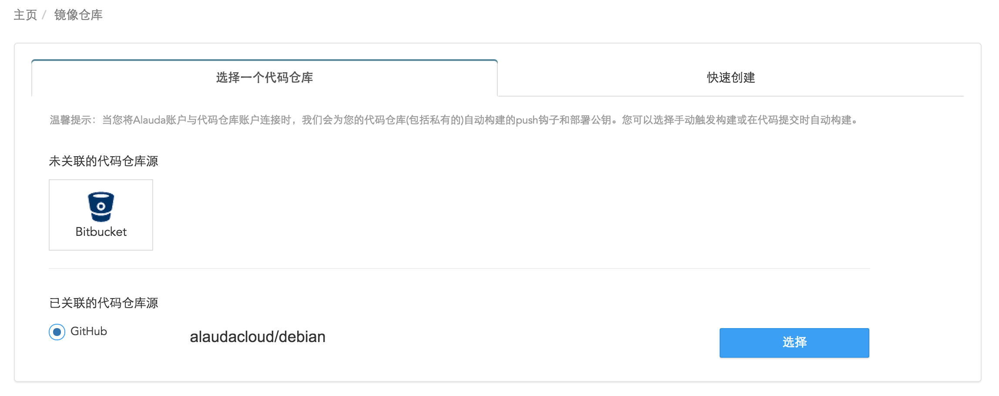
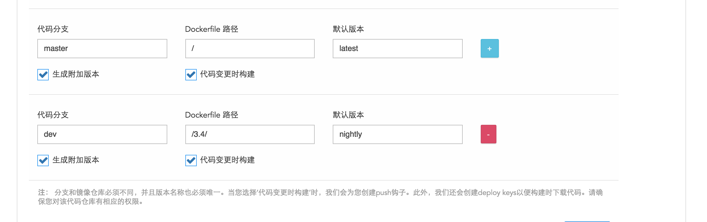
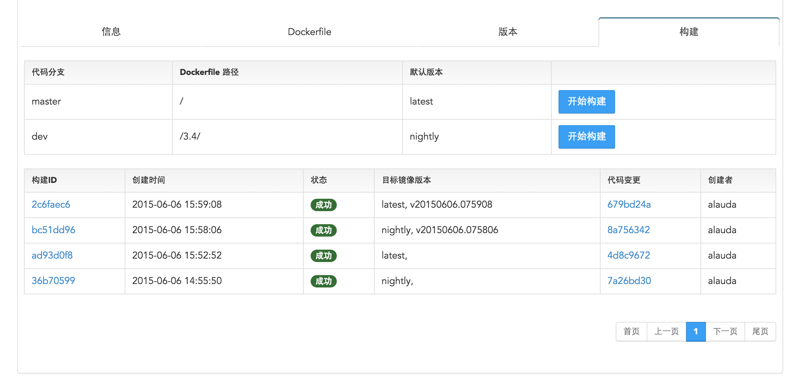

# 如何创建镜像构建仓库

登录Alauda云平台，在菜单上找到镜像仓库，点击“ 创建镜像仓库”按钮，在下拉菜单中选中“镜像构建仓库“。

可以通过两种方式创建镜像构建仓库：

1. 快速创建：

    * 您可以填写仓库名称（Repository Name）和代码仓库下载链接（Code Repository Clone URL）来创建一个构建仓库；
    
    这种方式可以快速创建一个构建仓库，但是这要求代码仓库可以被公开访问，且无法自动构建镜像，需要手动在页面触发构建操作。

2. 选择代码仓库创建：

    * 首先选择一个源代码仓库，目前我们支持主流的国外代码仓库源 － [GitHub](https://github.com/) 和 [Bitbucket](https://bitbucket.org/) 以及国内的 [OSChina](https://git.oschina.net/) ，未来我们会支持更多的代码仓库源。
    
    首次连接代码仓库时，我们需要您的授权来关联您在对应网站的账号，点击相应的图标，登录到您的账号，并点击授权按钮，页面会列出您的代码仓库。
    

    * 然后就可以通过链接代码源，选择您需要构建的代码，点击选择（Select）。
    
    在镜像仓库创建页面，输入镜像的名称和简要描述，同时选择仓库的共有（Public）私有（Private）属性。指定从代码仓库的哪一个代码分支（Branch）构建镜像，另外，输入您的Dockerfile在代码仓库中的路径（Alauda云平台通过Dockerfile构建镜像，所以您的代码仓库中必须存在至少一个Dockerfile）。

    镜像的版本（Image tag）默认为latest，您也可以选择其他名称。Alauda云平台在每次构建完成后，将默认镜像版本指向新生成的镜像。这就是说，您之前构建的镜像将无法被引用， 如果您希望保留每次构建的镜像版本，请选中“生成附加版本”选项，这样每次构建的镜像会获得一个与时间相关的版本，并一直保留。

    * 通常，构建镜像可以被手动触发，也可以被自动触发，即当代码被改变时自动触发。Alauda云平台支持这两种方式，如果您希望在代码被修改后自动触发构建镜像，请选中“代码变更时构建“选项。
    * 如果您希望从多个代码分支构建镜像，点击右边的”＋“按钮，增加一个构建的设置。
    

    以上设置都完成后，点击“创建”按钮，您的镜像构建仓库就创建好了。它与普通的镜像仓库最大的差别就是您无需push镜像，可以直接从代码仓库构建镜像并保存。

当您成功创建了镜像构建仓库后，您可以在菜单栏点击“构建”，也可以在创建的仓库中点击“构建”，然后点击“开始构建”，选择您需要构建的代码和版本号之后，系统会为您构建一个新的镜像。

最后，如果您需要修改或删除已关联的代码仓库源，您可以在用户设置页面取消关联，或重新关联新的账号。

成功构建一个镜像后，点击该镜像的镜像ID可以查看镜像的日志以及其他详细参数；点击镜像仓库可以查看该镜像构建仓库的详细信息；点击代码变更可以查看选择构建代码的Dockerfile内容。同时当您删除了这个镜像构建仓库后，通过该镜像仓库所构建的镜像也会一并被删除。所以当您要删除某个镜像构建仓库时，一定要慎重~

 
