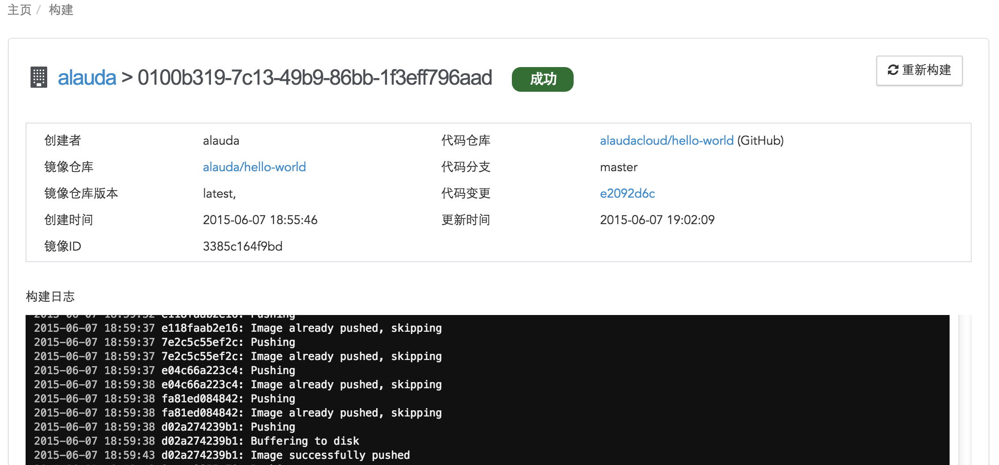

# 构建镜像详情
通过点击构建镜像ID进入到构建镜像详情页面：

* 状态：构建有四种状态，成功、失败、等待和进行中；
* 创建者：表示当前用户名；
* 镜像仓库：构建成功镜像将会上传至该仓库；
* 代码仓库：本次构建所对应的代码仓库；
* 镜像仓库版本：本次构建所生成的版本；
* 代码分支：本次构建所对应代码仓库的分支；
* 代码变更：本次构建对应代码仓库的提交版本；
* 镜像ID：本次构建生成的镜像ID；
* 创建时间：开始构建镜像的时间；
* 更新时间：日志最近一次更新时间；

镜像在等待状态下，您可以选择“删除”来停止当前构建。当您构建完成该镜像后，可以选择“重新构建”。

页面下方显示的为构建该镜像时的日志信息，您可以通过查看每次构建镜像时的日志，了解该镜像构建的过程，如果构建镜像出现问题时可以通过日志定位问题。
