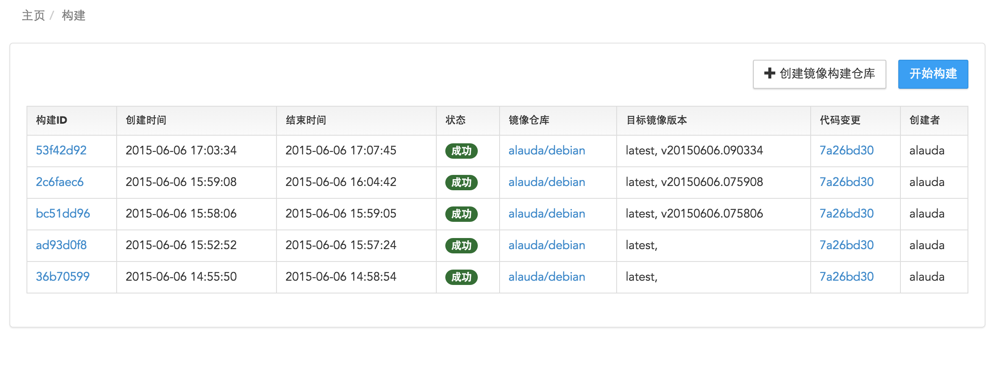
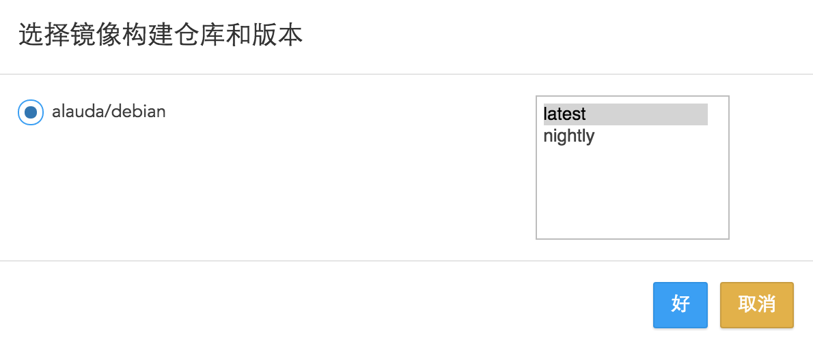

# 构建镜像列表
构建镜像列表展示出所有您构建的镜像以及所构建镜像的简略信息。

* 构建ID：您所构建的每个镜像系统都会为您分配一个ID，点击ID链接可以查看该镜像的详细信息。
* 创建时间：开始创建镜像时的时间。
* 结束时间：镜像创建结束的时间。
* 状态：构建镜像有四个状态分别为：成功，失败，等待和进行中。
* 镜像仓库：每个镜像所对应的镜像仓库，点击镜像仓库链接可以查看对应镜像仓库的详细信息。
* 目标镜像版本：Alauda云平台在每次构建完成后，将默认镜像版本指向latest。如果您希望保留每次构建的镜像版本（image tag），在构建仓库设置中选中 生成附加版本 选项，这样每次构建的镜像会获得一个与时间相关的标签，并一直保留。
* 代码变更：点击该链接，可以查看您构建代码的最近一次修改详情。
* 创建者：即您的用户名。
当您需要构建新的镜像时，点击右上角的“开始构建”按钮，选择您需要构建的镜像代码，点击“好“即可构建新的镜像。

