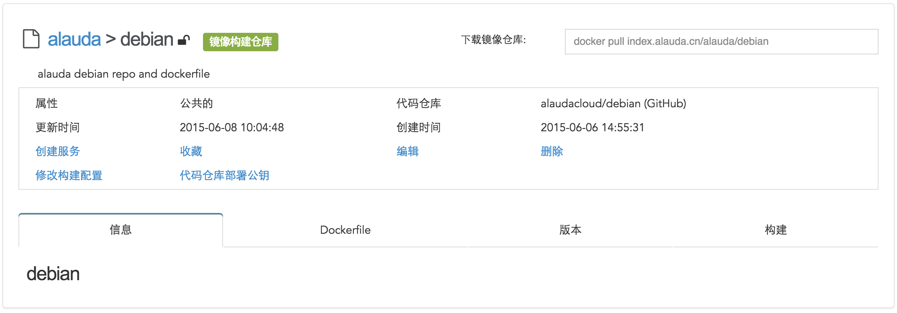

# 构建镜像仓库详情
构建镜像仓库信息与普通镜像仓库基本一致，但它有一些特有的属性和信息。

* 代码仓库: alaudacloud/debian (GitHub)表示该镜像仓库所关联代码仓库。
* 修改构建配置：进入该构建仓库的配置页面，修改配置参数，具体参数详解在[镜像构建](http://docs.alauda.cn/?page_id=51)部分已经做了解释，在此就不再赘述。
* 代码仓库部署公钥：当您将Alauda账户与代码仓库源如GitHub的账户连接时，我们会为您创建代码仓库的部署公钥，这样可以下载代码以便构建。但有时，我们没有权限将公钥添加到您的代码仓库设置里，所以需要您手动添加。
* Dockerfile：展示当前镜像构建仓库所关联的 Dockerfile 内容。
* 构建：展示构建信息及历史构建记录。

