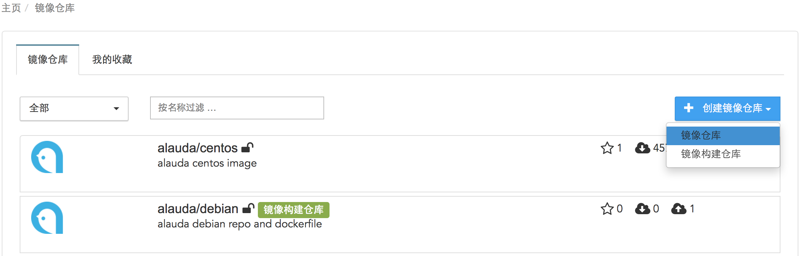
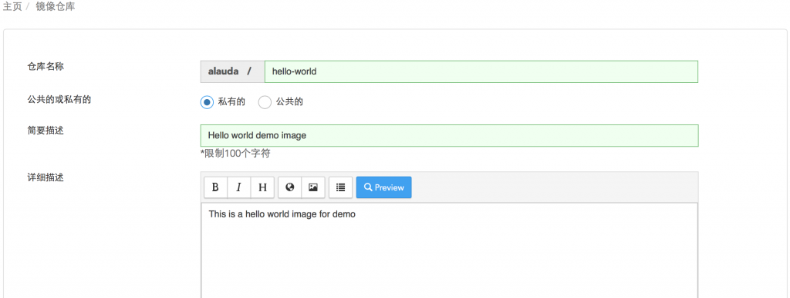

# 创建镜像仓库

在使用镜像（Image）存储服务前，首先要创建镜像（image）仓库。镜像（Image）仓库又分为普通的镜像仓库和镜像构建仓库。这一章只要讲述普通镜像仓库的创建，镜像构建仓库的创建在[镜像构建](image-building/introduce.md)中会详细介绍。

要创建一个镜像仓库，首先要登录Alauda云平台，在菜单上找到镜像仓库，点击“创建镜像仓库”按钮，在下拉菜单中选中“镜像仓库”。

在“仓库名称（Repository Name）”输入“hello-world”（名称可自定义，但只能由小写字母、数字和“-”组成），选择该仓库是公有（public）还是私有（private），输入“简短描述（Short Description）”信息，由于简短描述仅仅可以输入100个字符，所以，如果简短描述不足以让您描述清楚您的仓库，那么请在“详细描述（Full Description）”中填写您仓库的具体信息。详细描述使用的是markdown格式，如果您想了解markdown的语法，请参考[这里](http://daringfireball.net/projects/markdown/syntax)。填写完所有的信息后，点击“创建（Create）”按钮，就可以创建一个新的镜像仓库了。

在web上创建成功镜像仓库后，接下来就需要push image操作了。在本地通过命令行，输入

`sudo docker login index.alauda.cn`

并使用您在Alauda云平台注册的账户进行登录；然后需要对您的image进行标记，在命令行输入

`sudo docker tag image_name:tag index.alauda.cn/username/image_name:tag`

最后您就可以push您想存储在仓库的image了，在命令行输入

`sudo docker push index.alauda.cn/username/image_name:tag`

就可以把这个image push到您创建的仓库中了。完成上述步骤，您的镜像仓库已经创建完成了，现在就可以用您镜像仓库中的Image创建服务了~

