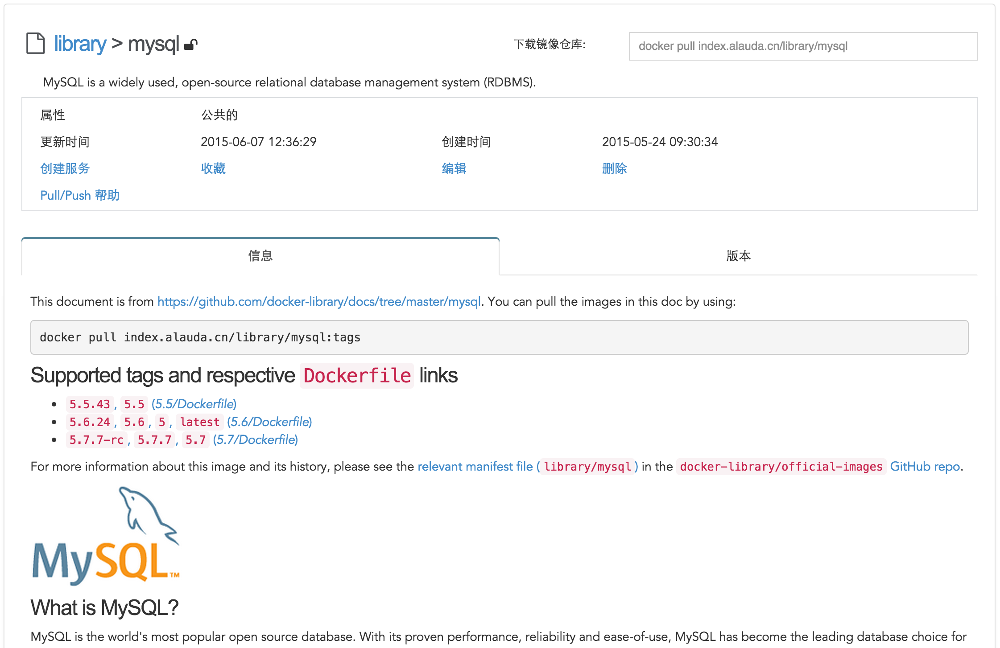

当您成功创建一个镜像仓库后，会自动跳转到镜像仓库详情界面。在这个界面可以显示出该镜像的详细信息：

 

* 简要描述：简单概述一下该镜像仓库；
* 属性：描述该镜像的公有/私有属性；
* 创建时间：该镜像的创建时间；
* 更新时间：该镜像的更新时间；
* 信息：描述该镜像的详细信息；
* 版本：展示该镜像的所有版本号。

同时可以在镜像仓库详情界面对该镜像仓库进行一些操作：

* 创建服务：通过点击创建服务，可以在Alauda云平台创建基于该镜像的服务；
* 收藏：可以收藏该镜像仓库，以备需要的时候使用；
* 编辑：点击编辑可以进入编辑镜像仓库页面，改变该镜像的公有/私有属性，简要描述以及详细描述等信息；
* 删除：点击删除，弹出确认对话框，点击确认后可以成功删除该镜像仓库；
* Pull/Push帮助：如果您对如何pull和push镜像不了解，请点击帮助文档查看具体操作步骤。
