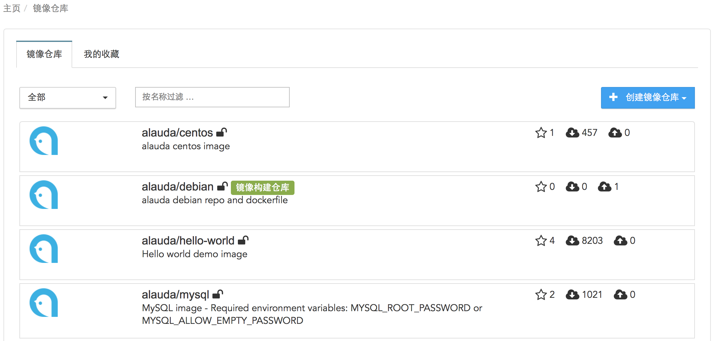
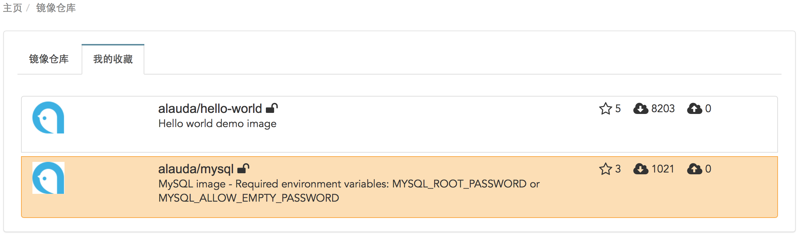

您创建的所有镜像仓库，包括普通镜像仓库和镜像构建仓库都会在镜像仓库列表中展示。可以通过左上角的下拉栏选择公有或私有镜像，已经可以通过输入框输入关键字来检索您需要的镜像仓库。

列表中，每个镜像仓库上都有关于该镜像仓库的相关信息：

* 镜像仓库所属的命名空间
* 镜像仓库名
* 镜像的访问权限
* 镜像仓库的简要描述
* 镜像仓库被收藏数
* 镜像仓库被下载的次数
* 镜像仓库上传的次数

而且镜像仓库列表还可以查看您所有收藏的镜像仓库，可以查看您收藏的镜像仓库的被收藏数以及上传下载次数等信息。可以通过点击收藏的镜像仓库查看该镜像的详细信息。

