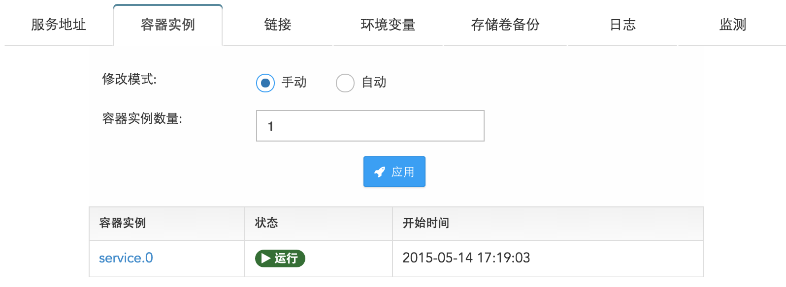
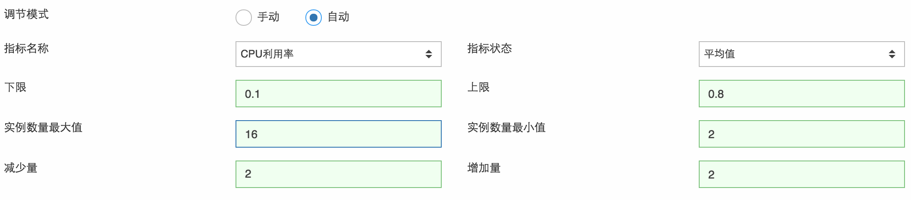

# 服务容量调节 － 手动 vs 自动
服务由于访问量的不同，可能需要不同的容量（Capacity）。服务的容量由服务所含实例（Instance）的个数和大小决定。改变实例的数量既可以实现调节服务的容量。调节的模式有两种：手动调节和自动调节。（注：只有无状态服务才可以有多个实例，有状态服务由于有数据和状态，无法一致的扩展到多个实例。）

手动调节：您可以直接修改服务的实例数量来调整服务的容量。在服务列表页面找到要修改的服务，点击该服务，进入服务详细页面，点击‘容器实例’标签页，模式选择手动，实例数量键入所需的实例数，点击‘应用’。（注：当服务处于停止状态时，可以将设置存储，当服务重新启动时，会按照新的设置运行。）

自动调节：服务在此模式下运行时，实例个数会根据用户选定的指标（如CPU使用率）和上下限在一个区间内自动调节。例如，实例数量的区间设为3到7，指标设为内存利用率，上下限为0.1和0.9，增量和减量均为1，统计值取实例的平均值。那么当实例的平均内存利用率超出90%时，实例数会增加1，系统等待2分钟后会再次查看指标平均值，如果仍然超出上限，实例数会再增加1，但最高不会超过区间最大值7。

在创建服务的时，您可以选择调节模式为自动，然后填写自动模式所需要的参数，系统将通过这些参数自动为您调整实例数量。在服务创建后，您也可以在服务详细页面，‘服务容器’标签页，设置自动调节模式。

* 指标名称：可以为CPU利用率或内存利用率；
* 指标统计值：可以为平均值，最大值，最小值，个数（count）和总和（sum）等，您可以根据需要设置。如最大值为所有实例的指标值中取最大值；
* 下限：当指标的统计值低于下限时，系统将减少当前的容器实例数量，为服务运行节约成本；
* 上限：当指标的统计值高于上限时，系统将增加当前的容器实例数量，增加服务容量；
* 实例数量最大值：当实例数到达最大值后，即使上限再次被满足，实例数量也不会再增长；
* 实例数量最小值：当实例数到达最小值后，即使下限再次被满足，实例数量也不会再减少；
* 减少量：当指标的统计值低于下限时，容器的实例数量将被减小的数量；
* 增加量：当指标的统计值高于上限时，容器的实例数量将被增加的数量；
