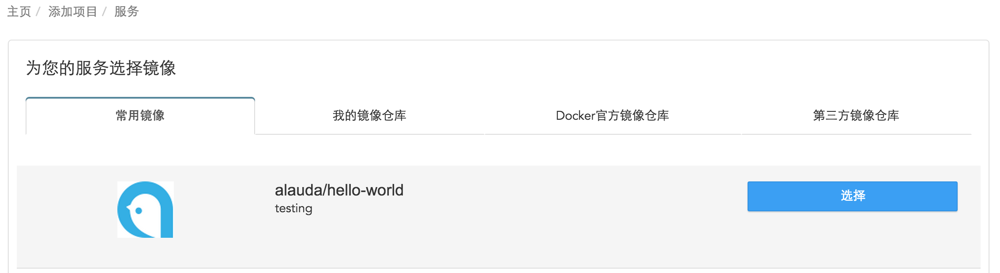
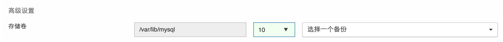
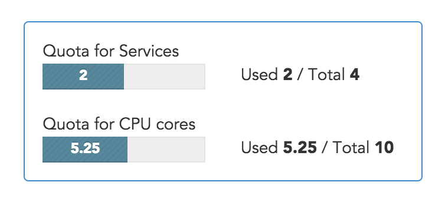

# 创建服务

首先登录Alauda云平台，在“服务”标签页，点击“创建服务”按钮，会看到有四个标签页，下面逐一介绍各个标签页：

* 常用镜像：该标签页中罗列出来了Alauda云平台所统计出来的用户经常使用的镜像，便于用户测试和熟悉系统功能。
* 我的镜像仓库：该标签页罗列出了用户自己已构建的镜像。
* Docker官方镜像仓库：该标签页允许用户输入镜像名称，系统会自动检索docker官方镜像仓库，如果查询到了您输入的镜像名称，在点击选择之后，系统会自动加载该镜像的环境变量，以便用户更快捷的创建服务。
* 第三方镜像仓库：该标签页允许用户输入其他的镜像仓库中的镜像名称，如quey.io。
在确定所需镜像之后，点击选择，就进入了创建服务的详细配置页面。

进入服务的详细配置页面，其中带红色*号的都是必填项。下面逐一介绍各个参数的作用：

* 镜像版本：必填项，您择镜像的版本。
* 服务名称：必填项，您所创建服务的名称。
* 容器实例大小：必填项，您所创建服务实例的大小，具体资源数量见页面右侧。
* 服务类型：分为有状态服务和无状态服务。详细信息参照[无状态服务VS有状态服务文档](stateless-service-and-stateful-service.md)。
* 调节模式：当服务类型为无状态服务的时有效，此选项用于用户明确实例数量调节方法，分为手动和自动。详细信息参照[服务容量调节](capacity.md)文档。
* 容器实例数量：当服务类型为无状态服务的时有效，此选项用于确定服务在启动时所包含的实例数量。
* 存储卷：当服务类型为有状态服务时有效，此选项用来设置镜像所需存储卷的大小，或者选择已备份过的快照来恢复服务。第一个输入框中的路径为此镜像构建之后默认的挂载路径。详细信息[参照存储卷备份](../volume/introduce.md)文档
  
* 使用这个镜像的执行命令和接入点：当为yes的时候，表示使用此镜像默认的执行命令和接入点，如果选择no，则可以重新进行执行命令和接入点的设置。
* 执行命令：启动服务时所执行的命令。
* 接入点：服务执行命令时需要的可执行脚本，覆盖shell默认的执行脚本（如/bin/sh）。
* 端口：此部分为网络设置，参照[网络设置](network-settings.md)描述文档。
* 链接服务：选择一个用户已创建的服务和此服务进行链接，这两连个服务之间就可以相互访问，进行数据通信等。比如web和mysql。并可以指定要链接的服务的别名。点击添加按钮，即可在下方的列表中查看已添加的链接。
* 环境变量：第一个输入框是环境变量的名称，第二个输入框是环境变量的值。输入完成后，点击后面的添加按钮，即可在页面最下面的列表中找到自己添加的环境变量。
* 运行服务：如果选择运行，服务创建成功后会自动运行，反之，创建成功后处于暂停状态。
当您填写完所需填写的参数并确保无误后，点击创建就可以创建一个服务了。如果您选择错了镜像，也可以点击重新选择镜像来重新选择您所需要的镜像。同时在页面右上方(如下图)有您创建服务的额度限制，如果创建的服务数量或者占用的cpu数量超过一定额度后，会导致您无法创建服务。

如果您需要创建更多地服务或需要更多地cpu数量，请发送邮件到[info@mathildetech.com](mailto:info@mathildetech.com)联系我们。

