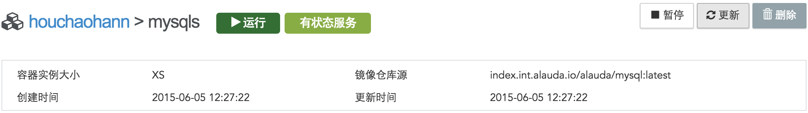
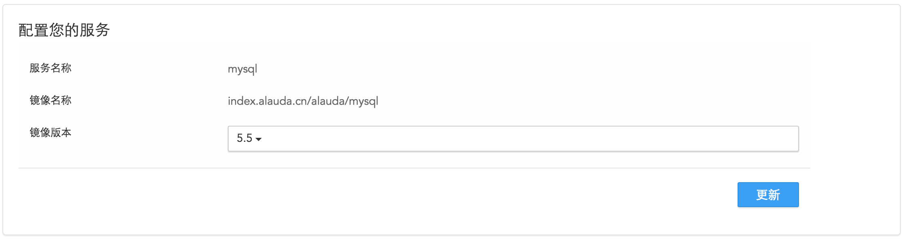
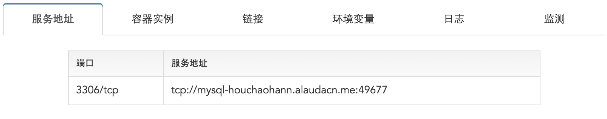

# 服务详情
当您成功创建一个服务后，会自动跳转到服务详情页面。在这个页面可以显示出该镜像的详细信息以及对该服务的一些操作。

在页面上方显示创建该服务时所选择和填写的一些参数：

* 运行表示该服务的状态，在不同的状态会显示运行，部署中，暂停等状态信息；
* 容器实例大小表示您创建服务时选择的实例大小；
* index.int.alauda.ioalauda/mysql:latest表示创建该服务的镜像；
* 创建时间表示您创建该服务的时间；
* 更新时间表示您对该服务进行重新部署或者修改实例数量等更新操作后的最新时间；
* 点击更新您会跳转到一个页面，可以修改镜像的版本或存储卷备份等信息对该服务进行更新。在该页面您可以修改镜像的版本；

在页面的下发显示出该服务的详细信息：

* 服务地址：您可以通过显示的服务地址和端口来访问您所创建的服务，该服务地址将通过负载均衡机制，将您的访问分配到服务的某一个容器实例中。如果您需要访问特定的容器实例，请进入该容器实例的详情页面，访问该容器实例的地址；
* 容器实例：可以查看您创建的容器实例数量信息，以及修改容器实例数量和调节模式等信息；
* 链接：显示出您所链接的其他服务；
* 环境变量：显示出该服务的所有环境变量；
* 存储卷备份：显示出存储卷备份的路径和大小，同时您可以点击后面的创建来为您的服务备份数据；
* 日志：显示出服务的运行日志；
* 监测：为您展示出该服务每个时间点的CPU利用率，内存利用率，发出字节和接收字节等信息。

通过查看服务的日志和监测方便您更有效率的管理您的服务，当您想要停止该服务却又想保持该服务的状态时，请点击右上角的暂停按钮即可，直到您想要再次使用该服务时，点击开始按钮。如果您不再使用该服务，可以点击删除按钮来删除这个服务，但是请注意该服务一旦被删除就无法恢复了，所以在删除服务的时候请您慎重考虑。
