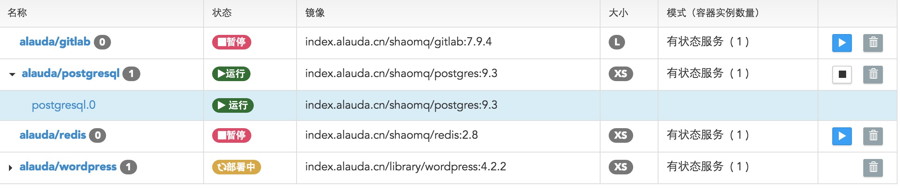

# 服务列表
服务列表展示出所有您创建的服务以及关于这些服务的相关简略信息。

* 名称：您所创建服务的名称；
* 状态：您所创建服务的状态，包括运行，部署中，停止，错误等状态；
* 镜像：创建该服务的镜像以及镜像版本；
* 大小：创建该服务时选择容器实例的大小；
* 调节模式：包括自动调节模式和手动调节模式，并且显示出当前的容器实例数量；
该页面还有对服务的相关操作：

* 点击服务名称可以查看该服务的详细信息；
* 点击服务的一行任意地方，展示出该服务的全部容器实例，并且在您点击容器实例名称时可以查看对应实例的详细信息；
  
* 点击小方框图标，可以暂停该服务，如果服务处于暂停状态，点击可以开启该服务；
* 点击垃圾桶图标，可以删除该服务，一旦您删除了该服务，将不能恢复，所以在删除服务的时请慎重考虑。
