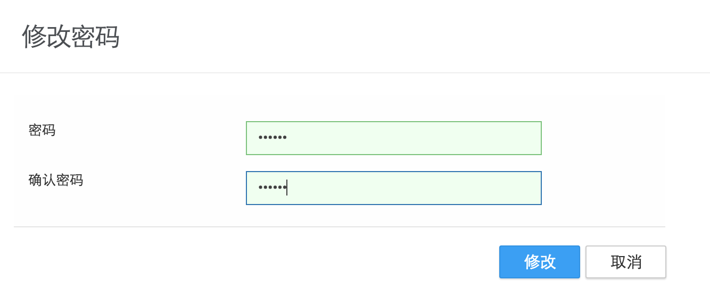
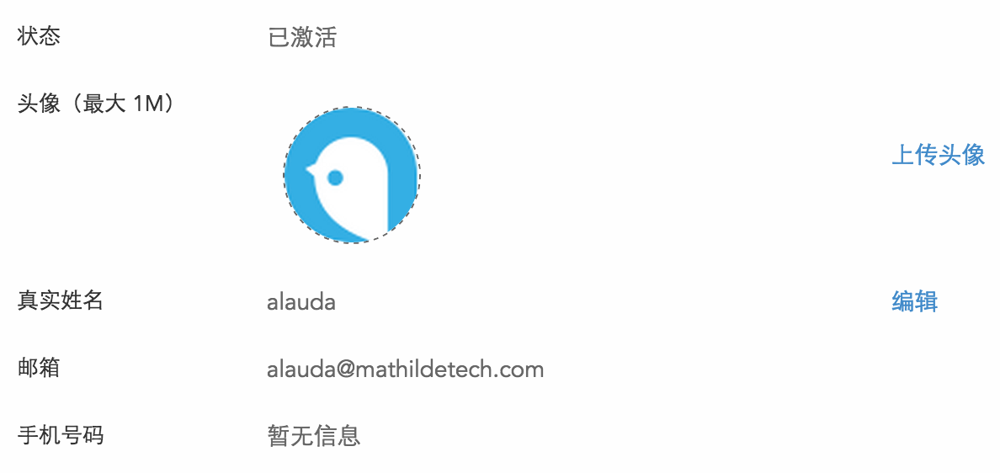
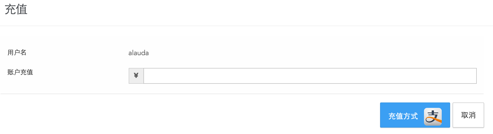
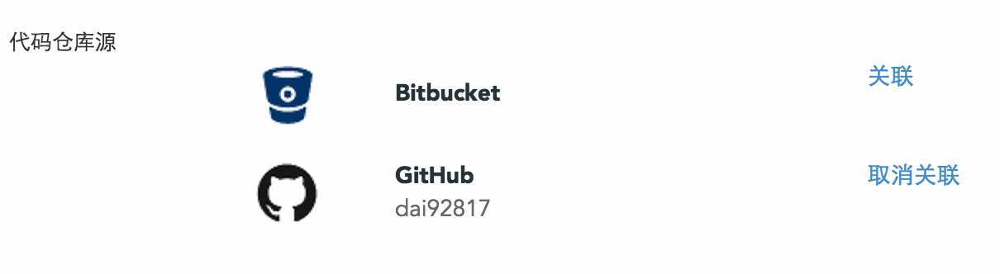

# 用户设置
用户信息页面为您展出您当前用户的详细信息，其中有一些信息可以修改，如密码，真实姓名，手机号码等信息，同时可以进行账户充值以及关联代码仓库源等操作，下面为您逐一作出详细介绍。

* 用户名：您当前用户的名称；
* 密码：出于对您账号的安全考虑，并没有明文的显示您的密码，通过点击修改密码，您可以跳转到相应页面对您的密码进行修改。
  

* 状态：当前账户的状态，一般情况下为已激活状态；
* 头像：当前账户的头像，您可以通过点击修改头像链接来上传您的头像；
* 真实姓名：默认为您创建时的用户名，您可以对其进行修改；
* 邮箱：注册账户时填写的邮箱地址；
* 手机号码：注册账户时填写的手机号码；
  
* 公司：注册账户时填写的公司名称，如果注册时未填写，显示为暂无信息；
* Token：可以利用Token来访问Alauda云平台提供的一些接口；
* 币种：即当前账户的币种，目前分为CNY和USD两种。
* 您的剩余金额：表示您当前账户的余额，余额不足时可以点击充值链接跳转到充值页面进行充值；
  
* 代码仓库源：目前我们支持两个主流的代码仓库源 － GitHub 和Bitbucket，未来我们会支持更多国内的代码仓库源。可以通过点击关联或取消关联，来管理您的是否连接代码仓库源。
  
