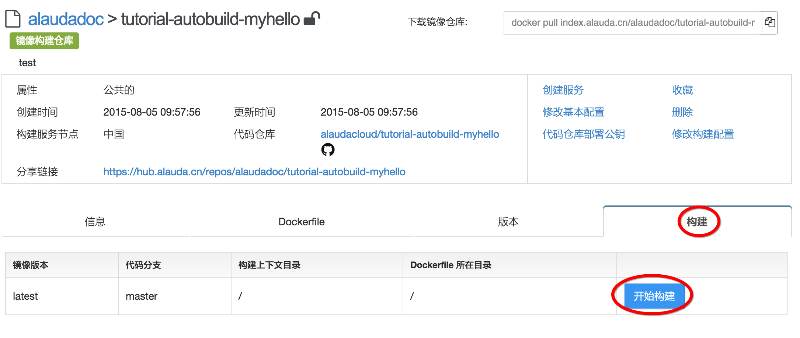

# 第八章　第一个属于自己的镜像　从代码自动构建镜像

在上一章，我们创建的镜像仓库虽然可以pull或push镜像，但这些都需要手工来操作。在实际中，我们更多的是希望能够从代码仓库中自动生成镜像，这样会更加方便实用。在本章，您将学习灵雀云是如何为用户提供这个强大的功能的。

## 创建代码仓库

首先您需要有一个代码仓库，目前灵雀云支持github和bitbucket，我们在教程中使用github做示例，bitbucket的操作是类似的。如果您还没有github账号，请先注册账号。

登录github，然后创建一个“tutorial-autobuild-myhello”代码仓库。接着打开本地的命令行窗口，为代码仓库添加以下内容：

	git clone https://github.com/alaudacloud/tutorial-autobuild-myhello.git
	cd tutorial-autobuild-myhello
	touch server.js
	touch Dockerfile

我们为这个代码仓库增加了两个文件：“server.js”和“Dockerfile”。其中server.js的内容是：

```javascript
var http = require("http");
var os = require("os");
http.createServer(function(request, response) {
	console.log("New request arrived.");
	response.writeHead(200, {"Content-Type": "text/plain"});
	response.write("Hi, you are visiting " + os.hostname() + "\n");
	response.end();
}).listen(80);
console.log("Server is running, listening on port 80....");
```

这个代码和[第六章](debug.md)的代码是一样的。而Dockerfile的内容是：

```
FROM ubuntu:trusty
MAINTAINER alaudadoc alaudadoc@alauda.cn

RUN apt-get update && apt-get install -y nodejs
EXPOSE 80
COPY server.js /
CMD ["nodejs", "/server.js"]
```

这是一个非常简单的dockerfile，其功能就是在容器中安装nodejs环境，并把上面的server.js代码运行起来，同时声明外部可以访问80端口，下面我们提交代码：

		git add .
		git commit -m "add my code"
		git push -u origin master

代码提交后，我们可以看到bitbucket的代码仓库中已经有了我们刚增加的Dockerfile和server.js。

## 创建镜像构建仓库

有了代码仓库后，我们现在创建“镜像构建仓库”。镜像构建仓库本质上是一个镜像仓库，但是它里面的镜像不是通过用户手工推送(push)上来的，而是通过灵雀云的自动构建功能自动推送进来的，因此这种仓库不支持手工推送。

点击控制台上方菜单“镜像仓库”进入镜像仓库列表，可以看到我们之前创建的“alaudadoc/hello”，点击右侧的“+创建镜像仓库”，选择“镜像构建仓库”。


在代码仓库选择列表中选择“关联GitHub”，这时页面可能会要求您的代码仓库对灵雀云授权。


授权通过后，您的git账号中的所有代码仓库都会在页面上列出来，选择“alaudacloud/tutorial-autobuild-myhello”，点击“选择”按钮进入配置页面。

在配置页面中，一些必要的参数已经填好了，我们只需要填写“简要描述”。对于本章的示例，我们还需要手工修改一个配置：“服务构建节点”请选择“中国”。然后点击创建。


创建完成后，我们可以看到镜像构建仓库的详细信息页。进入到“构建”标签页，点击“开始构建”。



下方出现本次构建的信息，点击“构建ID”，可以查看本次构建的更多信息，以及构建日志。


构建成功后，镜像仓库“alaudacloud/tutorial-autobuild-myhello”里将会多一个“latest”镜像版本和一个类似“v20150805.025327”的版本号，表示镜像已经构建成功，并且可以在创建服务的时候使用了。

## 使用自动构建的镜像部署服务

我们现在创建一个新的服务，使用刚刚构建成功的含有我们代码的镜像。在刚才镜像仓库详细信息页面上找到“创建服务”的链接，点击，输入我们要创建的服务名称“myhello”，点击“创建”按钮。服务创建成功后，点击服务地址，就能够访问到我们的代码所提供的服务了。


## 自动构建

接下来我们修改一下server.js，将内容改为：

```javascript
var http = require("http");
var os = require("os");
http.createServer(function(request, response) {
	console.log("New request arrived.");
	response.writeHead(200, {"Content-Type": "text/plain"});
	response.write("Welcome to my website! you are visiting " + os.hostname() + "\n");
	response.end();
}).listen(80);
console.log("Server is running, listening on port 80....");
```

提交后，我们点击控制台的“构建”菜单，可以看到有个新的构建正在运行，这个构建就是由于代码变化而系统自动产生的构建新的镜像的过程。稍等几分钟后，更新过的镜像就构建完成了。


## 升级服务

刚才我们对代码进行了修改，现在需要把刚才创建的myhello服务升级到最新的版本。点击控制台的“服务”菜单，选择myhello服务进入到详细信息页面。在“停止”按钮旁边有一个“更新”按钮。点击该按钮。


现在我们选择新的“镜像版本”（注意，不能选latest）。然后点击“更新”按钮，稍等一会儿服务开始重新部署。直到部署成功后，我们再次点击服务地址，就会看到弹出的页面返回的欢迎信息和之前不一样了，服务已经完成了更新。


