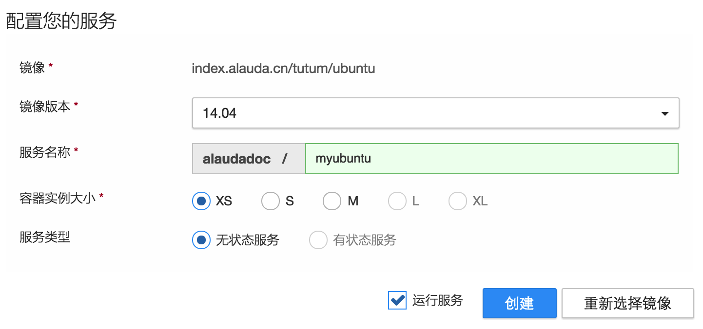
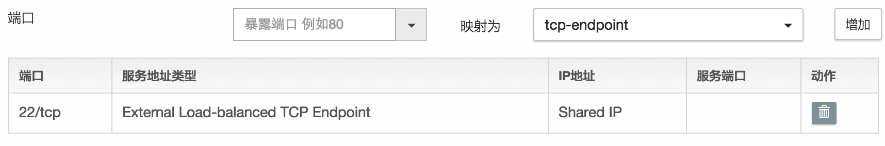
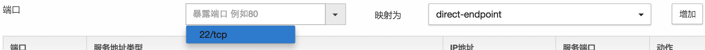
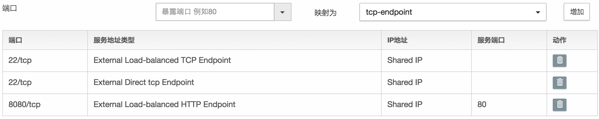
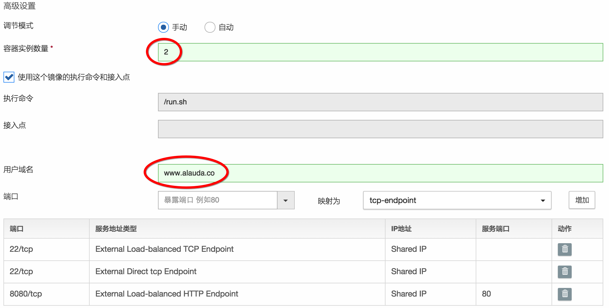
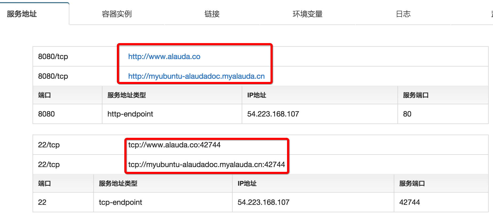
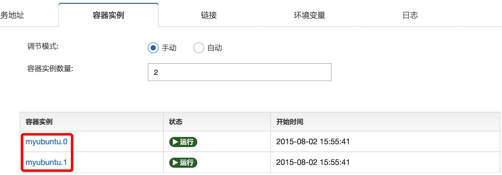
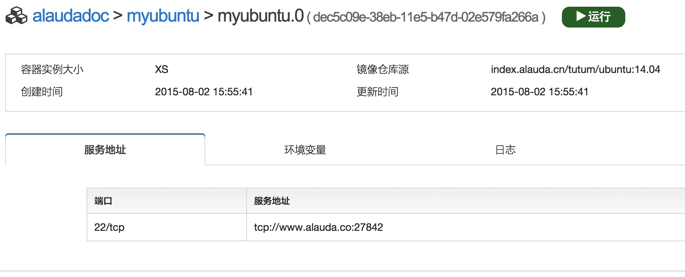

# 第五章　与外界通信　给服务配置端口和域名

我们已经学会了如何创建最基本的服务，在服务配置时，我们除了选择镜像的版本和指定服务名之外，全部使用的是默认配置。实际上，灵雀云为我们提供了非常多的高级功能，本章我们将学习如何为我们的服务配置不同的端口类型以及指定一个自己的域名。

## 配置服务

删除之前的myubuntu服务，我们在本章将要创建一个新的ubuntu服务。请按照[第三章](service-with-ssh.md)的步骤，选择tutum/ubuntu镜像和14.04的版本，并仍然命名为“myubuntu”。但是不要点击“创建”按钮。

接着我们看“创建”按钮下方的高级配置，在高级配置中，有一项是“端口”配置。系统默认已经给tutum/ubuntu的22/tcp端口配置了一个“tcp-endpoint”的服务地址（Endpoint）。

“tcp-endpoint”的全称是“External Load-balanced TCP Endpoint”。“External”表示灵雀云为该端口创建的负载均衡器(LB)可以从外部访问（即被用户访问），“TCP Endpoint”表示该LB是一个TCP映射，映射后的供外部访问的端口是一个随机端口，这也就是为什么我们在[第二章](hello-world.md)创建的hello服务还是通过80端口访问，而[第三章](service-with-ssh.md)创建的myubuntu却不是22端口，而是42744，因为myubuntu服务默认的端口类型是“TCP Endpoint”，42744是灵雀云为该服务的22端口随机分配的外部访问端口。

接下来，我们将给要创建的新ubuntu服务的端口配置更多类型的服务地址。首先在端口下拉选项中选中“22/tcp”，在“映射为”选择“direct-endpoint”，然后点“添加”按钮。

这样我们就为“22/tcp”增加了一个新的`direct`类型的服务地址。接着我们再增加一个`http`类型的服务地址。在“端口”下拉选项框中，手工输入“8080/tcp”，“映射为”选择“http-endpoint”，点击“添加”按钮。最终添加完后的界面如下图：

我们先不用管新添加的这两个服务地址是什么含义。在“端口”配置的上方，有一个“容器实例数量”的配置项，这就是我们上一章介绍的容器实例数量在创建时的配置项。其默认值是“1”，我们修改为“2”。最后我们会发现在端口配置的上方有一个“用户域名”的输入框，请输入一个你自己拥有的域名，本章示例里将输入“www.alauda.co”。

现在点击“创建”按钮，把服务运行起来。服务创建成功后，可以在“服务地址”页签看到22和8080两个端口各有一个服务地址，一个是tcp类型，一个是http类型，其中http类型的服务地址可以像[第二章](hello-world.md)一样直接点击，而tcp类型的地址需要像[第三章](service-with-ssh.md)一样使用。同时每个服务地址都有两个域名，一个是灵雀云为用户提供的默认域名，另一个是刚才用户在“用户域名”里自己输入的。

在“容器实例”页签里，可以看到已经创建并运行起来的两个实例：“myubuntu.0”和“myubuntu.1”。

## 访问direct-endpoint端口

现在我们用第三章的SSH方法登录刚创建的ubuntu服务。你会在服务日志中发现有两个密码，这是因为有两个实例，我们无法区分哪个实例的密码是哪个。即使我们能够知道每个实例的密码是什么，我们尝试使用ssh登录的时候也会发现每次登录进去的容器可能是不同的，因为默认的TCP类型的服务地址是一个负载均衡器(LB)，每次登录时会随机选择一个容器。特别是当我们调试程序的时候，往往需要登录一个确定的容器，而不是任何一个容器都行。因此这个时候就需要使用容器的direct-endpoint了。

之前我们访问的tcp或者http类型的服务地址都是“服务”的访问地址，即你访问它的时候，访问的是这个服务。而“direct”类型的服务地址实际上是“容器”的地址。我们现在点击“容器实例”列表里的“myubuntu.0”或者“myubuntu.1”

这个容器只有一个“direct”服务地址，就是图中显示的`tcp://myubuntu-alaudadoc.myalauda.cn:27842`，密码可以在容器的日志里看到，然后我们通过这个地址就可以ssh到这个容器实例中。我们也可以用同样方法登录myubuntu.1的容器实例。

## 访问http-endpoint端口

我们在创建服务的时候还给“8080/tcp”配置了一个“http-endpoint”，在服务的“服务地址”页签中，也有`http://myubuntu-alaudadoc.myalauda.cn`的链接。需要注意的是，如果一个端口配置了“http-endpoint”，那么不管容器暴露的是不是80端口，它的访问地址一定是80。由于我们没有给8080配置direct-endpoint，所以该端口在实例的详细信息页面上是找不到的。在本章中，虽然我们给8080配置了访问地址，但由于“tutum/ubuntu”这个镜像并没有在8080端口监听，所以我们访问`http://myubuntu-alaudadoc.myalauda.cn`是没有正确的返回结果的。

## 设置用户域名
刚才我们已经可以通过灵雀云提供的默认域名访问22端口的服务，如果我们有程序在容器里的8080端口监听，也是可以被
`http://myubuntu-alaudadoc.myalauda.cn`访问的。但即使这样，我们还是无法访问`www.alauda.co`这个用户自定义的域名。虽然灵雀云已经把这个域名必要的设置都完成了，但是有一项工作必须由用户自己完成，那就是将“用户域名”指向“默认域名”。

请登录提供用户域名的域名服务商（可能是www.namecheap.com或者www.net.cn等域名服务商）的网站，在域名的主机设置中，加入一条CNAME记录。在我们的示例中，主机名是“www”，类型是“CNAME”，对应的值是`myubuntu-alaudadoc.myalauda.cn`。设置完成后，稍等一会儿，就可以解析`www.alauda.co`这个域名了。当然此时你访问这个地址还是什么也看不到。在下一章，我们将往这个服务里面增加8080端口的监听程序，让这个端口有一个真正的web服务响应用户请求。
