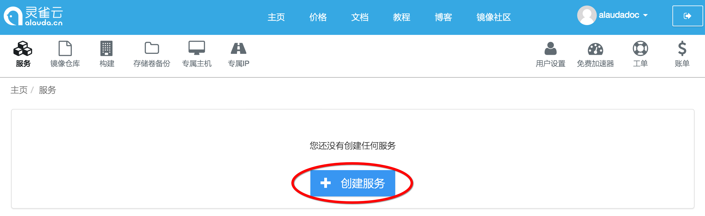
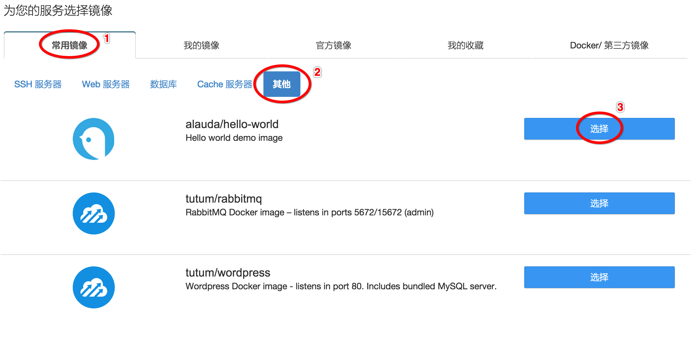
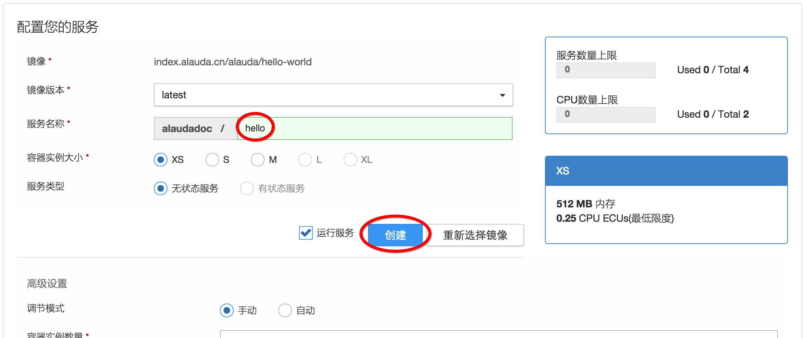
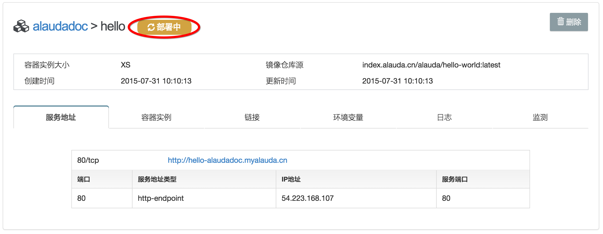
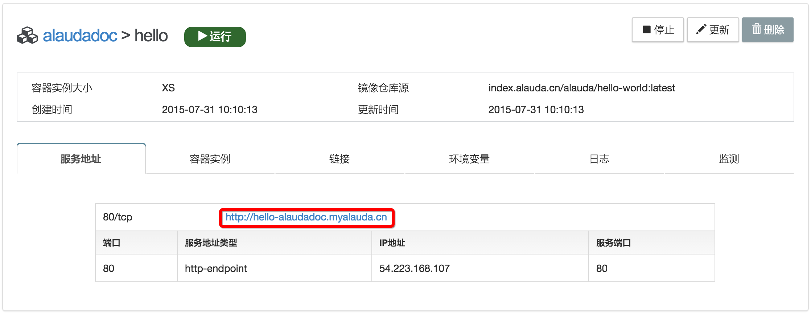
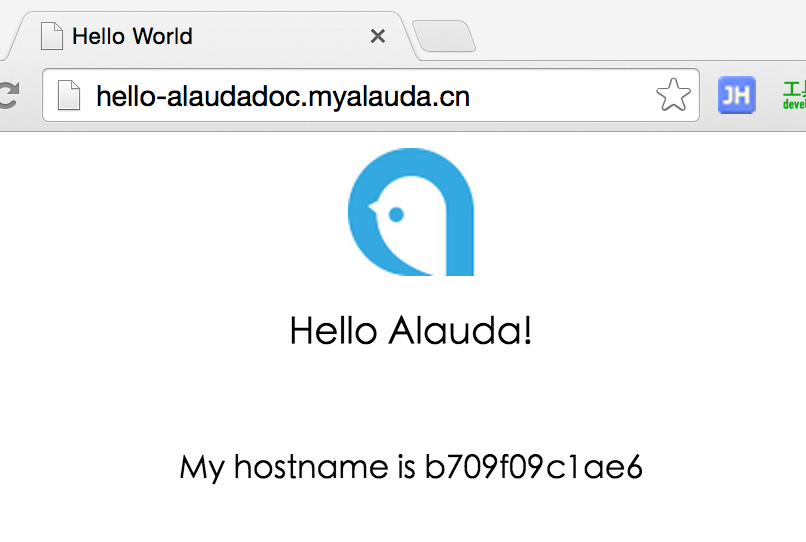

# 第二章　创建服务如此简单　第一个Hello World服务

接下来我们将要创建我们的第一个Hello World服务，您将会发现使用灵雀云创建一个服务，将会是多么的简单。首先您需要登录灵雀云，并进入控制台首页。

在控制台的默认首页，由于您尚未创建任何服务，因此页面正中间有一个“+创建服务”的按钮，点击该按钮进入创建服务页面。

创建服务，首先需要选择一个镜像。灵雀云已经为您提供了一些常用的镜像列表。请在“常用镜像”列表中，选择“其它”，然后找到“alauda/hello-world”镜像，点击它右侧的“选择”按钮，进入服务参数配置页面。

选择完要创建的镜像后，需要配置服务的参数。创建最简单的Hello World服务只需要设置服务的名称即可。请在“服务名称”输入框里输入“hello”，然后点击下方的“创建”按钮，开始真正的创建服务。

在创建的过程中，页面会显示“部署中”，表示尚未完成，稍等片刻后，状态会改为“运行”，这就表示服务已经部署成功，我们的第一个Hello World已经创建成功了。

服务创建成功后，可以在当前的服务详细信息页面的“服务地址”标签页里找到该服务的80/tcp端口对外的服务地址：`http://hello-alaudadoc.myalauda.cn`。灵雀云会为每个服务的每个端口创建一个默认的域名和端口，用户可以通过这个域名和端口访问服务。

点击服务地址，会弹出一个新的页面，这个页面就是我们创建的Hello World服务返回的页面。

至此，您已经成功创建了第一个Hello World服务，并且也能够成功地访问该服务，一切就是这么简单。

