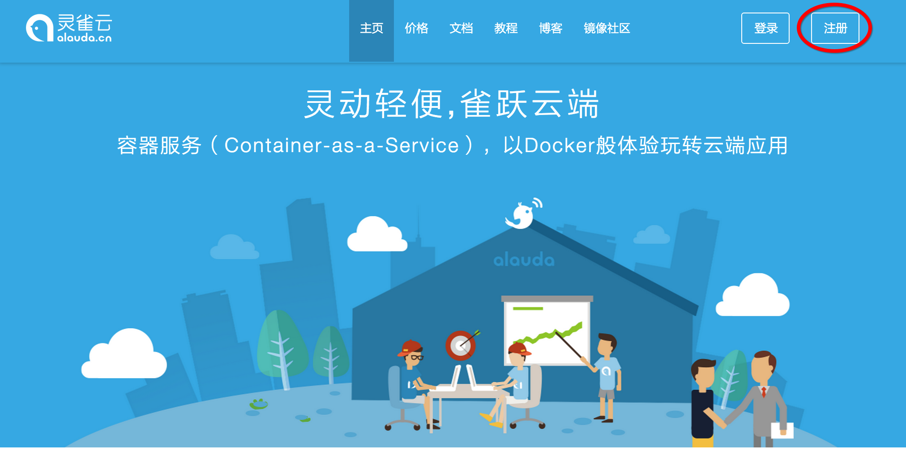
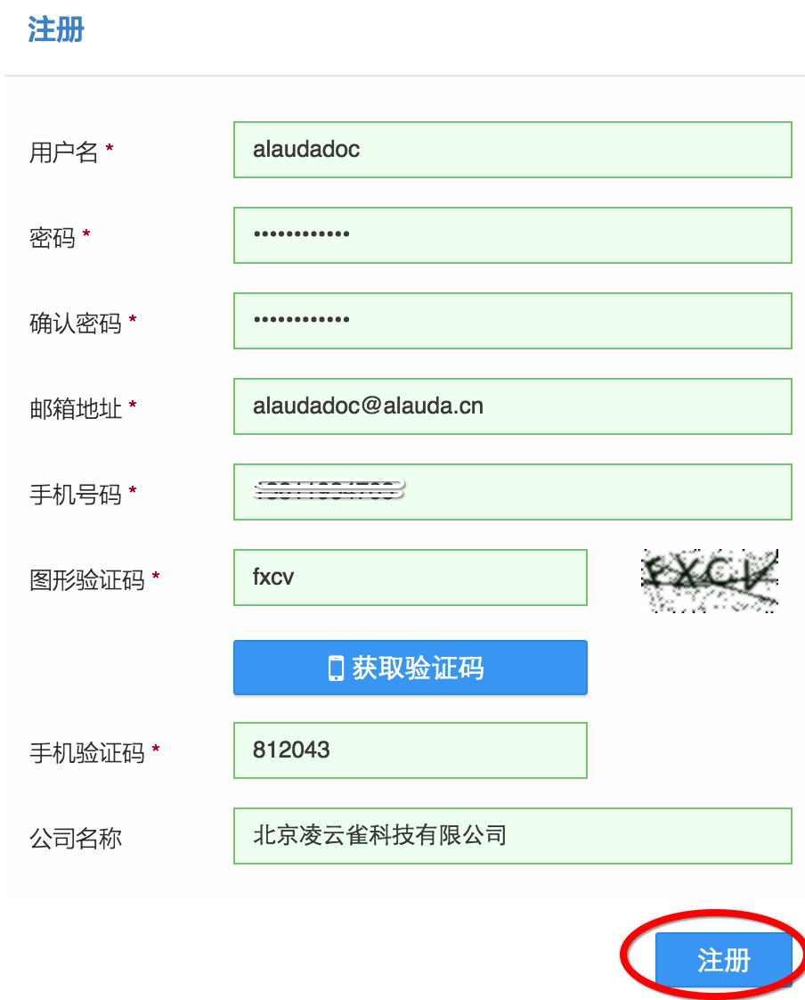

# 第一章　初识灵雀云　注册账户

## 注册

使用灵雀云要做的第一件事当然是要注册一个账户。注册的过程非常简单，首先请访问 [http://www.alauda.cn/](http://www.alauda.cn/) 点击页面右上角的“注册”按钮。

为了便于我们与您联系以及为你及时发送灵雀云的最新动态，请您填写真实的邮箱地址和手机号码。填写完后，点击下方的“注册”按钮。

这时，您填写的邮箱里会收到一封邮件，请点击邮件上的链接，完成账户激活。

## 登录

注册完账号后，请重新访问 [http://www.alauda.cn/](http://www.alauda.cn/) 点击页面右上角的“登录”按钮

填写用户名和密码，点击“登录”按钮。

登录成功后，页面会进入控制台首页，即服务列表页面。

