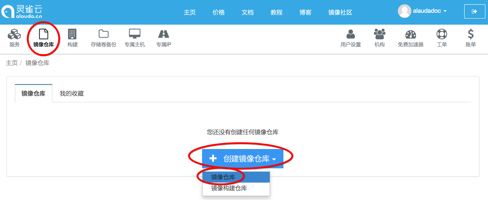
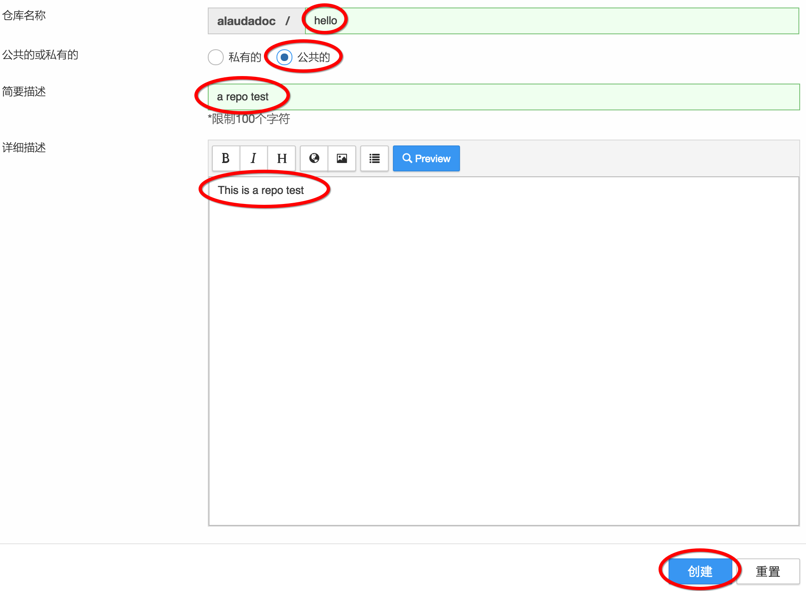
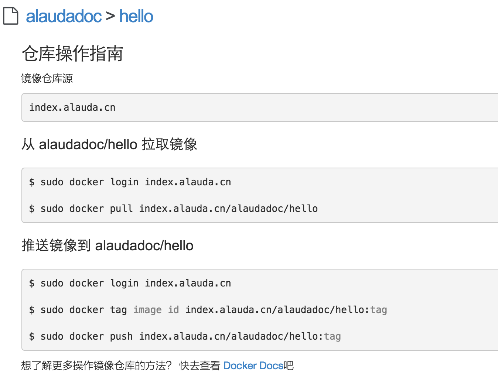
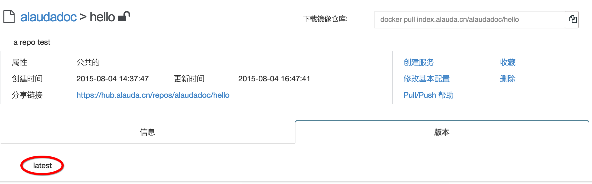
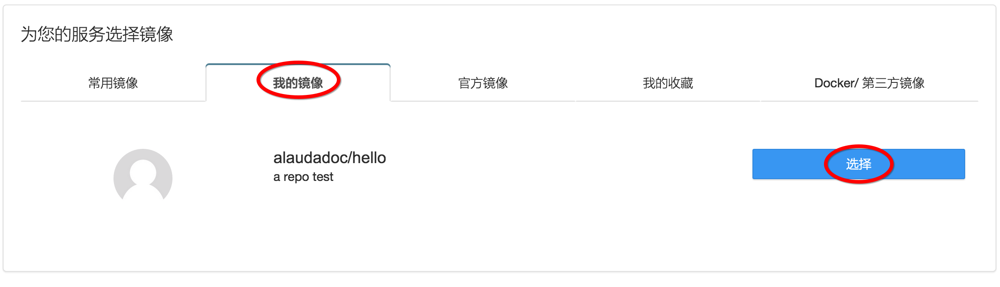
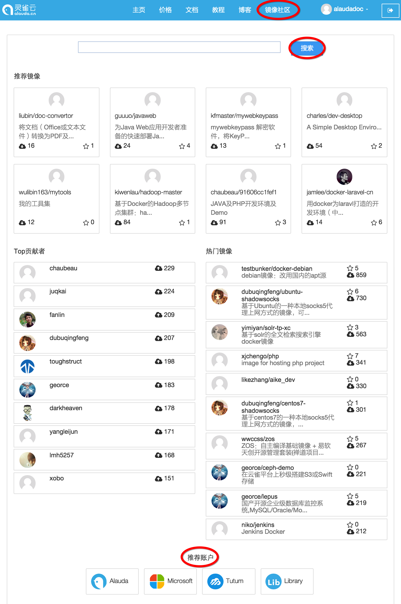

# 第七章　管理镜像　镜像的基本操作

前几章，我们已经学会了创建服务，并访问服务。本章我们将学习使用灵雀云的镜像管理功能。

## 创建镜像仓库

登录灵雀云网站，在控制台首页，选择“镜像仓库”，点击正中间的“创建镜像仓库”按钮，然后选择“镜像仓库”。

在镜像仓库创建的配置页中，输入仓库名称hello，选择“公共的”，并加上简要和详细描述，并按“创建”按钮。

镜像仓库创建成功后，页面会显示“仓库操作指南”，这里有镜像仓库的基本命令行操作。使用方法和docker官方的docker hub是类似的。接下来，我们会一个个地学习。

## 使用命令行操作镜像

* 登录灵雀云镜像仓库源

在本机打开一个命令行窗口，首先登录镜像仓库源，方法和登录docker hub是一样，只是需要加上灵雀云的镜像仓库源地址“index.alauda.cn”

	$ sudo docker login index.alauda.cn

* 从灵雀云拉取镜像

现在我们从灵雀云上把第二章创建“hello world”服务使用的镜像拉取到本地：

	$ sudo docker pull index.alauda.cn/alauda/hello-world

* 推送镜像到灵雀云

本地这时已经有了“alauda/hello-world”，我们将它命名为我们刚刚创建的镜像仓库的名称“alaudadoc/hello”，然后再推送到镜像仓库里。

	$ sudo docker tag index.alauda.cn/alauda/hello-world index.alauda.cn/alaudadoc/hello:latest
	$ sudo docker push index.alauda.cn/alaudadoc/hello:latest

## 浏览镜像仓库属性

回到灵雀云的界面，选择“镜像仓库”菜单，在镜像仓库列表中点击刚刚创建的“hello”，进入到镜像仓库详细信息界面。点击下方的“版本”，在这里我们可以看到已经有了刚刚推送的“latest”版本。

我们还可以通过点击镜像仓库属性右侧的“创建服务”，直接创建该镜像的服务。也可以在创建服务选择镜像的时候，选择“我的镜像”页签，然后点击“选择”，如下图：

## 浏览别人的镜像

灵雀云除了让用户推送镜像供自己创建服务使用，还提供了镜像社区，在这里你可以浏览、搜索其他人的各种优秀有趣的镜像。

点击网站的上方的“镜像社区”，您可以看到提供搜索镜像的“搜索”功能，推荐镜像等各种信息，页面的最下方是灵雀云推荐给用户的几个镜像仓库：

* alauda：灵雀云提供给用户的一些镜像，如第二章使用的“alauda/hello-world”镜像
* microsoft：微软提供的官方镜像
* tutum：tutum提供的镜像，很多都可以通过默认配置创建服务，方便学习和演示。
* library：docker官方镜像，与docker hub上对应的docker镜像完全一样，是快速使用docker官方镜像的最佳替代镜像

