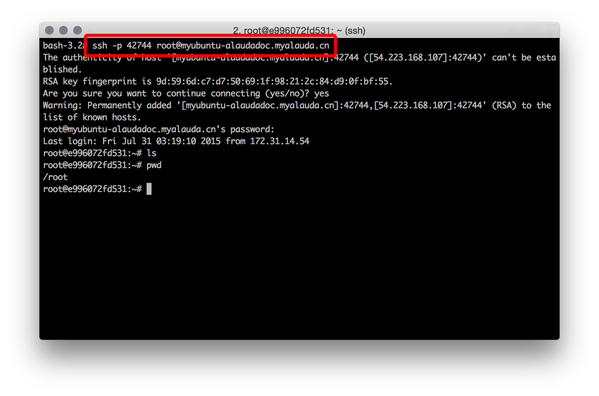

# 第三章　像用物理机一样　一个具有交互功能的ubuntu服务

上一章，我们学会了如何创建一个Hello World服务，这是一个最简单的web服务，什么功能都没有。本章，我们将要去创建一个ubuntu服务，您可以登录到这个ubuntu容器里进行各种操作，就如同你登录到一台ubuntu的物理机或虚拟机一样。

点击页面上的“服务”页签，回到服务列表。由于此时您已经有了至少一个服务，所以“+创建服务”的按钮被挪到了页面的右侧，点击“+创建服务”。

我们这次在“常用镜像”中，选择“SSH 服务器”里的“tutum/ubuntu”镜像，然后点击“选择”按钮。

在服务配置页面中，我们这次手动选择一下要创建的服务所使用的镜像的版本(tag)。请在“镜像版本”里，选择“14.04”，然后在“服务名称”里里输入“myubuntu”，然后点击“创建”按钮。

服务部署成功后，在“服务地址”标签页里可以看到这个ubuntu服务的“22/tcp”端口的服务地址是“`tcp://myubuntu-alaudadoc.myalauda.cn:42744`”，它表示的是这个ubuntu服务对外的访问域名是“myubuntu-alaudadoc.myalauda.cn”，同时如果你访问这个域名的42744/tcp端口，就等于是在访问这个ubuntu服务的22/tcp端口，即它的sshd的端口。

登录这个创建的ubuntu需要用户名和密码，tutum/ubuntu默认生成的用户名是root，密码是随机生成的，在服务的日志里有。所以我们需要打开“日志”页签，在日志里找到类似下面的这段文字，其中“JYmUkv9hxhq2”就是为root用户生成的随机密码。

按照日志里的登录格式以及用户名和密码，我们打开自己电脑上的命令行窗口，然后敲入“`ssh -p 42744 root@myubuntu-alaudadoc.myalauda.cn`”，当提示要输入密码时，请输入root用户的随机密码“JYmUkv9hxhq2”，这样我们就通过ssh登录进入到了刚创建的ubuntu容器里。

在这个ubuntu容器里，您可以使用ls、pwd、apt-get等ubuntu命令，和你在一台装有ubuntu 14.04的物理机上使用ubuntu是完全一样的。
