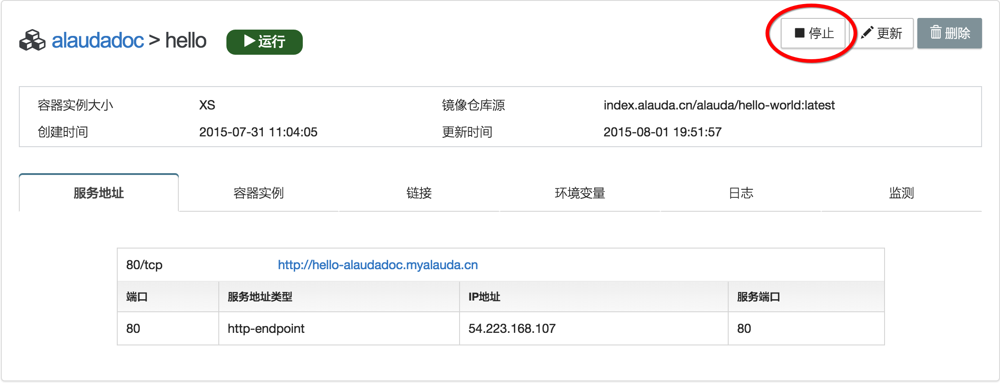

# 第四章　丰富的功能　服务的各种操作

我们已经学会了如何创建最基本的服务，本章我们将学习这些服务都有哪些常用的操作。

## 调节容器实例数量

我们回到在[第二章](hello-world.md)时创建的“Hello World”服务。在我们创建的时候，所有的配置都是系统默认值，创建出来的服务也只有一个实例，实例是真正运行镜像的docker容器，一个服务可以由一个也可以由多个实例组成，每个实例的服务应当是完全一样的。在这一节里，我们学习通过灵雀云更改一个已创建的服务的实例个数。

首先在服务列表页面中，点击我们之前创建的“hello”服务，进入到服务的详细信息页面，点击下方的“容器实例”标签。我们可以看到在最下面的容器列表栏里，只有一个容器“hello.0”，找到它上方的“容器实例数量”，将原来的“1”改为“2”，然后它点击下面的“应用”按钮。

稍等几秒钟后，服务进入“部署中”的状态，然后再等几秒钟重新变为“运行”状态，这就表示实例数量调节完毕。我们这时会发现容器列表里变成了两个容器“hello.0”和“hello.1”。

现在我们再次访问`http://hello-alaudadoc.myalauda.cn`，如果多访问几次，你会发现页面显示的内容略有不同，hostname的值可能会不一样。

这是因为此时的hello服务虽然有两个实例构成，但是灵雀云实际上为该服务创建了一个`负载均衡器`（Load Balancer，以下简称LB），当用户访问`http://hello-alaudadoc.myalauda.cn`的时候，实际上访问的是该LB，LB会随机的选择一个实例容器响应用户的请求，这就是为什么当我们多几次访问hello服务的时候，hostname的值不一样，那是因为每次请求可能由不同的实例提供服务，而每个实例的hostname是固定的。

实例数量可以增大，也可以减小，方法是一样的。

## 停止和启动服务

在我们创建完服务后，服务会自动运行起来。我们也可以停止服务也可以重新启动已停止的服务。还是打开正在运行的hello服务的详细信息页面，右上角有一个“停止”按钮。

点击“停止”按钮，稍等一会儿，服务就会变成“暂停”状态，同时“停止”按钮变成了“开始”按钮。

如果我们再次点击“开始”按钮，服务会重新被启动。

## 删除服务

在服务详细信息页面右上方除了有停止按钮外，还有一个“删除”按钮，点击删除按钮，系统会提示您是否确认删除，如果确认删除，就可以删除当前服务，否则将取消该操作。

